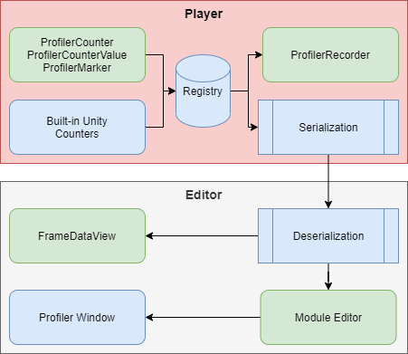
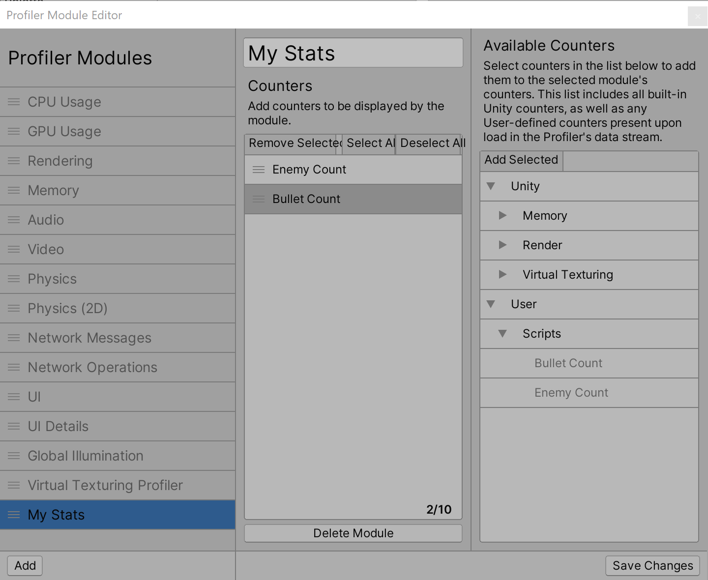
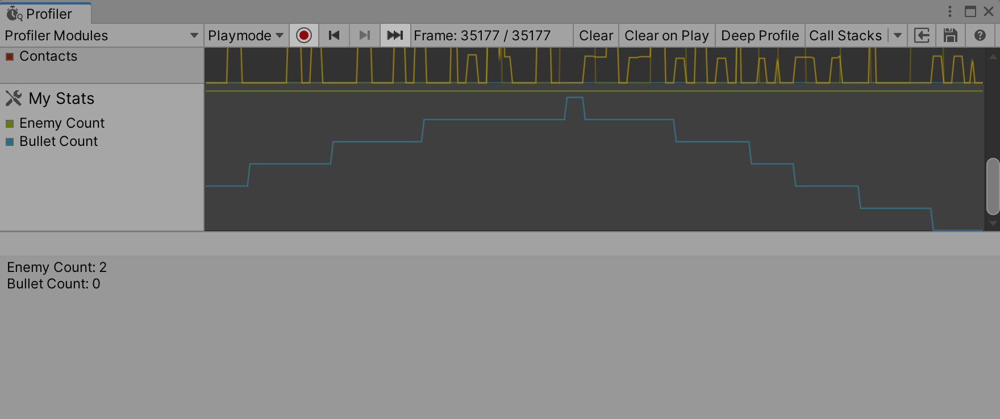

# Profiler counters API guide

You can use the `ProfilerCounter` or `ProfilerCounterValue` API to track the integral metrics of your application and make them visible in the Unity Profiler or in other code. This is particularly useful if you want to track performance changes in your application, and it speeds up the investigation of performance issues because you can use the information from your Profiler counters in conjunction with Unity built-in counters and instrumentation data. 

If you are an Asset Store package developer, you can add Profiler counters to your code to help other developers to understand important performance characteristics of your system, and they can use this information for optimization or budgeting tooling.

The following diagram displays a high level overview of the Profiler counters data flow:
<br/>*Profiler counters flow.*

The [ProfilerRecorder](https://docs.unity3d.com/2020.2/Documentation/ScriptReference/Unity.Profiling.ProfilerRecorder.html) API retrieves Profiler counter data in your application code, and the [RawFrameDataView](https://docs.unity3d.com/2020.2/Documentation/ScriptReference/Profiling.RawFrameDataView.html) or [HierarchyFrameDataView](https://docs.unity3d.com/2020.2/Documentation/ScriptReference/Profiling.HierarchyFrameDataView.html) APIs retrieves Profiler counter data in the Editor code. Additionally, you can visualize this counter data in the Profiler Window by [configuring a custom Profiler Module in the Module Editor](#viewing-counters).

`ProfilerCounter` and `ProfilerCounterValue` support the following types:

* int
* long
* float
* double

## How to pass counter values to the Profiler

The Profiler counters API supports push and pull operations. You can push the value of the counter to the Profiler, or the Profiler can pull the value at the end of the frame.

If your data changes infrequently - for example once per frame, use the `ProfilerCounter` API to push the counter data to the Profiler. If your data changes multiple times per frame, use the `ProfilerCounterValue` API. This makes the Profiler automatically pick up the last value at the end of the frame. The following example shows you how to use these APIs to set up and pass counter values to the Profiler

### 1. Define counters
To pass counter values to the Profiler, you must first define which counters you want to send. The following example uses `ProfilerCounter` for the enemies count because the value changes infrequently. Additionally, the example uses `ProfilerCounterValue` for bullet count because a player or enemies might fire many bullets per frame. 

```C#
using Unity.Profiling;

class GameStats
{
    public static readonly ProfilerCategory MyProfilerCategory = ProfilerCategory.Scripts;

    public static readonly ProfilerCounter<int> EnemyCount =
        new ProfilerCounter<int>(MyProfilerCategory, "Enemy Count", ProfilerMarkerDataUnit.Count);

    public static ProfilerCounterValue<int> BulletCount =
        new ProfilerCounterValue<int>(MyProfilerCategory, "Bullet Count",
            ProfilerMarkerDataUnit.Count, ProfilerCounterOptions.FlushOnEndOfFrame);
}
```
### 2. Update the value
The next example assumes that the `GameManager` class handles high level logic and knows about enemies. To update the value of the counter, in the `Update` or `LateUpdate` method (depending on when the logic is performed with spawning or destroying enemies), you can use `Sample` method to push the enemies count value to the Profiler.

```c#
using UnityEngine;
using Unity.Profiling;

class GameManager : MonoBehaviour
{
    Enemy[] m_Enemies;

    void Update()
    {
        GameStats.EnemyCount.Sample(m_Enemies.Length);
    }
}
``` 

To pass the bullet count to the Profiler, this example assumes that there is a Shell script that manages the bullet lifecycle. It then increases the `GameStats.BulletCount` value in `Awake` and decreases it in `OnDestroy` to give accurate information about the current bullet flow in the game.

```c#
using UnityEngine;
using Unity.Profiling;

public class Shell : MonoBehaviour
{
    void Awake()
    {
        GameStats.BulletCount.RawValue += 1;
    }
    void OnDestroy()
    {
        GameStats.BulletCount.RawValue -= 1;
    }
}
```

>[!NOTE]
>Both `ProfilerCounter` and `ProfilerCounterValue` are compiled out in non-development builds.

<a name="viewing-counters"> </a>
## Viewing the counters in the Profiler Window

You can view the data that `ProfilerCounter` or `ProfilerCounterValue` generates in the Profiler Window in a custom Profiler Module. This might help to visually recognise relationships with other system metrics and identify performance issues quickly. You can use the Module Editor to select built-in or newly added counters for the visualization. To open the Profiler Module Editor, open the Profiler Window (**Window &gt; Analysis &gt; Profiler**) and then select the Profiler Module dropdown in the top left of the window. Click the gear icon, and the Profiler Module Editor opens in a new window.

<br/>*Profiler Module Editor window.*

You can then view the data in the Profiler Window alongside with other counters.

<br/>*Module with custom counters in the Profiler Window.*

>[!NOTE]
>Counters declared as `static` are dynamically initialized in the C# code when a type is initialized and might not be available until they are actually initialized and used. This applies to both Edit and Play Modes.
If you don't see your counters appearing in the Module Editor, record some data with the profiler first until some frames passed that should have send values through these counters.


## Getting counter values in Players

Profiler counters give you an insight into important game or engine system metrics. If you have a continious integration setup or want to visualize key performance metrics in your application during a test play through you can use the [ProfilerRecorder](https://docs.unity3d.com/2020.2/Documentation/ScriptReference/Unity.Profiling.ProfilerRecorder.html) API to get custom Profiler counter values as well as Unity built-in counters.

For example, the following script displays the frame time, Mono/IL2CPP heap size, and total memory that the application uses.

```c#
using System.Collections.Generic;
using System.Text;
using Unity.Profiling;
using UnityEngine;

public class StatsScript : MonoBehaviour
{
    string statsText;
    ProfilerRecorder systemMemoryRecorder;
    ProfilerRecorder gcMemoryRecorder;
    ProfilerRecorder mainThreadTimeRecorder;

    double GetRecorderFrameAverage(ProfilerRecorder recorder)
    {
        var samplesCount = recorder.Capacity;
        if (samplesCount == 0)
            return 0;
        
        double r = 0;
        unsafe
        {
            var samples = stackalloc ProfilerRecorderSample[samplesCount];
            recorder.CopyTo(samples, samplesCount);
            for (var i = 0; i < samplesCount; ++i)
                r += samples[i].Value;
            r /= samplesCount;
        }

        return r;
    }

    void OnEnable()
    {
        systemMemoryRecorder = ProfilerRecorder.StartNew(ProfilerCategory.Memory, "System Used Memory");
        gcMemoryRecorder = ProfilerRecorder.StartNew(ProfilerCategory.Memory, "GC Reserved Memory");
        mainThreadTimeRecorder = ProfilerRecorder.StartNew(ProfilerCategory.Internal, "Main Thread", 15);
    }

    void OnDisable()
    {
        systemMemoryRecorder.Dispose();
        gcMemoryRecorder.Dispose();
        mainThreadTimeRecorder.Dispose();
    }

    void Update()
    {
        var sb = new StringBuilder(500);
        sb.AppendLine($"Frame Time: {GetRecorderFrameAverage(mainThreadTimeRecorder) * (1e-6f):F1} ms");
        sb.AppendLine($"GC Memory: {gcMemoryRecorder.LastValue / (1024 * 1024)} MB");
        sb.AppendLine($"System Memory: {systemMemoryRecorder.LastValue / (1024 * 1024)} MB");
        statsText = sb.ToString();
    }

    void OnGUI()
    {
        GUI.TextArea(new Rect(10, 30, 250, 50), statsText);
    }
}
```

Don't forget to use `ProfilerRecorder.Dispose()` to free unmanaged resources associated with the `ProfilerRecorder`.

>[!NOTE]
>Not all Profiler counters are available in the Release Players. Use [ProfilerRecorder.Valid](https://docs.unity3d.com/2020.2/Documentation/ScriptReference/Unity.Profiling.ProfilerRecorder.Valid.html) to determine if the data is available and the Profiler can record it. Alternatively, you can use [ProfilerRecorderHandle.GetAvailable](https://docs.unity3d.com/2020.2/Documentation/ScriptReference/Unity.Profiling.LowLevel.Unsafe.ProfilerRecorderHandle.GetAvailable.html) to enumerate all available Profiler stats.

## Getting counter values from Profiler Frame data in the Editor

To get Profiler counter values when processing Profiler frame data in the Editor, use the [FrameDataView](https://docs.unity3d.com/2020.2/Documentation/ScriptReference/Profiling.FrameDataView.html) API. 

You can use the [FrameDataView.GetCounterValueAsInt](https://docs.unity3d.com/2020.2/Documentation/ScriptReference/Profiling.FrameDataView.GetCounterValueAsInt.html), [FrameDataView.GetCounterValueAsLong](https://docs.unity3d.com/2020.2/Documentation/ScriptReference/Profiling.FrameDataView.GetCounterValueAsLong.html), [FrameDataView.GetCounterValueAsFloat](https://docs.unity3d.com/2020.2/Documentation/ScriptReference/Profiling.FrameDataView.GetCounterValueAsFloat.html) and [FrameDataView.GetCounterValueAsDouble](https://docs.unity3d.com/2020.2/Documentation/ScriptReference/Profiling.FrameDataView.GetCounterValueAsDouble.html) to get a frame value of the specific counter, like so:

```c#
using UnityEditor.Profiling;

class Example
{
    static int ExtractMyCounterValue(FrameDataView frameData, string counterName)
    {
        var counterMarkerId = frameData.GetMarkerId(counterName);
        return frameData.GetCounterValueAsInt(counterMarkerId);
    }
}
```
